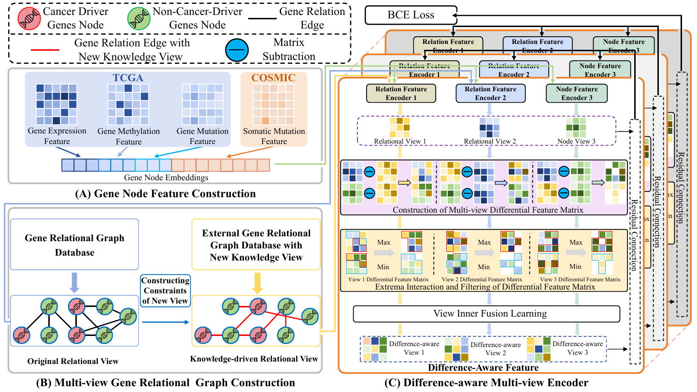

# DiffLearn
DiffLearn proposes a difference-aware multi-view learning framework that explicitly models cross-view discrepancies and captures subtle functional perturbations overlooked by traditional feature fusion methods. By effectively exploiting difference features, it addresses the challenge of multi-view semantic fusion in the following aspects:

* **Gene Node Feature Construction:** Gene Node Feature Construction generates high-quality semantic features for each gene by integrating TCGA multi-omics data with COSMIC somatic mutation features.

* **Multi-view Gene Relational Graph Construction:** This stage creates two complementary biological network views, an original relational view from benchmark networks and a knowledge-driven relational view from BioGRID, providing diverse topological perspectives for difference modeling.

* **Difference-aware Multi-view Encoder:** This module explicitly captures and leverages cross-view differences as the primary learning signal, transforming inter-view discrepancies into discriminative feature representations for accurate driver gene identification.

* **The framework of DiffLearn is as follows:**


## Install based on Ubuntu 18.04
Ensure you have installed CUDA 10.1 before installing other packages

**1.Python environment:** recommending using Conda package manager to install
```
conda create -n DiffLearn python=3.8
conda activate DiffLearn
```

**2.Python package:**
```
torch == 1.7.1+cu110
torch-geometric == 1.7.2
torch-scatter == 2.0.7
torch-sparse == 0.6.9
torch-cluster == 1.5.9
```

## Quick Start
### Evaluation
Tested on specific datasets from {CPDB, STRING, PathNet}.
```
python main.py -cancer "<dataset>" -lr <learning rate> -dropout <node dropout rate> -dropout_edge <edge dropout rate> -cv <fold number> -num <number experiments>

(e.g., dataset==CPDB,learning rate==0.001,node dropout rate==0.5,edge dropout rate==0.5,fold number==5,number experiments==5):
python main.py -cancer "CPDB" -lr 0.001 -dropout 0.5 -dropout_edge 0.5 -cv 5 -num 5
```